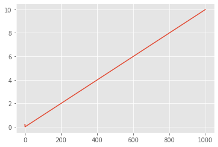
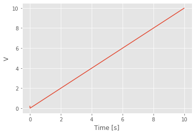
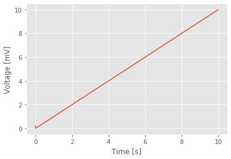
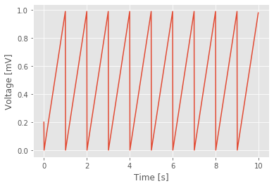

---
redirect_from:
  - "/a03/lif"
interact_link: content/A03/LIF.ipynb
kernel_name: python3
title: 'Integrate and Fire Model'
prev_page:
  url: /A02/HH
  title: 'Hodgkin Huxley Model'
next_page:
  url: /A04/perceptron
  title: 'Training a Perceptron'
comment: "***PROGRAMMATICALLY GENERATED, DO NOT EDIT. SEE ORIGINAL FILES IN /content***"
---

# The integrate and fire neuron

In this module we will use Python to simulate the integrate and fire (I&F) neuron model.  We'll investigate, in particular, how the spiking activity varies as we adjust the input current $I$.

# Background information about the I&F model

Here's a video that describes a slightly more complicated model, the *leaky* integrate and fire model.


{:.input_area}
```python
from IPython.lib.display import VimeoVideo
VimeoVideo('140084447')
```


<div markdown="0" class="output output_html">

        <iframe
            width="400"
            height="300"
            src="https://player.vimeo.com/video/140084447"
            frameborder="0"
            allowfullscreen
        ></iframe>
        
</div>


Here's some additional intereting videos and references:

- [Lecture by Prof. Gerstner](http://klewel.com/conferences/epfl-neural-networks/index.php?talkID=1)

##  Preliminaries
Before beginning, let's load in the Python packages we'll need:


{:.input_area}
```python
import numpy as np
%matplotlib inline
import matplotlib.pyplot as plt
```


##  Part 1:  Numerical solutions - Introduction

 
How do we compute a numerical solution to the integrate and fire model?
  The basic idea is to rearrange the differential equation to get $V(t+1)$ on
  the left hand side, and $V(t)$ on the right hand side.  Then, if we know
  what's happening at time $t$, we can solve for what's happening at time $t+1$.

For example, consider the differential equation:

  $$\dfrac{dV}{dt} = \dfrac{I}{C}$$

  In words, we can think of:

  $dV$ as the "change in voltage V",

  $dt$ as the "change in time t".

  Let's consider the case that we record the voltage $V$ in discrete time steps. So
  we observe:

  $V[0], V[1], V[2], \ldots$

  at times:

  $dt, \, 2*dt, \, 3*dt, \ldots$

  where $dt$ is the time between our samples of $V$.

  We can now write the "change in voltage V" as:

  $$dV = V(t+1) - V(t)$$

  Notice that the change in voltage is the difference in V between two
  sequential time samples.  Now, let's rewrite $\dfrac{dV}{dt}$ as,

  $$\dfrac{dV}{dt} = \dfrac{ V(t+1) - V(t) }{ dt } $$

  where we've replaced $dV$.  Now, let's substitute this expression into the equation at the top of this file:

  $$\dfrac{ V(t+1) - V(t) }{ dt } = \dfrac{I}{C}.  $$

  Solving this equation for $V(t+1)$ you'll find  that:

  $$V(t+1) = V(t) + dt*(I/C)$$

  Notice that, in this expression, we use our current value of the voltage V(t) and the model (I/C) to determine the next value of the voltage V(t+1).
  
  Now, let's program this equation in Python.  First, let's set the values
  for the parameters $I$ and $C$.


{:.input_area}
```python
C=1.0
I=1.0
```


  We also need to set the value for $dt$.  This defines the time step for our
  model.  We must choose it small enough so that we don't miss anything
  interesting.  We'll choose:


{:.input_area}
```python
dt=0.01
```


Let's assume the units of time are seconds.  So, we step forward in time by $0.01$ s.

The right hand side of our equation is nearly defined, but we're still missing one thing, $V(t)$.

<div class="alert alert-block alert-info">
**Q:**  What value do we assign to $V(t)$?<br><br>

**A:**  We don't know --- that's why we're running the simulation in the first place!
</div>

So here's an easier question:  what *initial* value do we assign to $V(t)$?
 
 To start, we'll create an array of zeros to hold our results for $V$:


{:.input_area}
```python
V = np.zeros([1000,1])
V.shape
```


{:.output .output_data_text}
```
(1000, 1)
```


This array `V` consists of 1000 rows and 1 column. We can think of each row entry as corresponding to a discrete step in time. Our goal is to fill-in the values of `V` (i.e., step forward in time), in a way consistent with our model.

Let's choose an initial value for `V` of 0.2, which in our simple model we'll assume represents the rest state.


{:.input_area}
```python
V[0]=0.2
```


<div class="alert alert-block alert-info">

**Q:**  Given the initial state `V[0]=0.2`, calculate `V[1]`.  Then calcualte `V[2]`.

</div>

  After the two calculations above, we've moved forward two time steps into
  the future, from $t=0$ s to $t=0.01$ s, and then from $t=0.01$ s to $t=0.02$ s.  But what
  if we want to know $V$ at $t=10$ s?  Then, this iteration-by-hand procedure becomes
  much too boring and error-prone.  So, what do we do?  Let's make the
  computer do it ...


## Part 2:  Numerical solutions - implementation

Let's computerize this iteration-by-hand procedure to find `V[999]`. To do so, we'll use a [for-loop](https://wiki.python.org/moin/ForLoop).  Here's what it looks like:


{:.input_area}
```python
for k in range(1,999):
    V[k+1] = V[k] + dt*(I/C)
```


<div class="alert alert-block alert-info">
**Q:**  Does this loop make sense?  Describe what's happening here.
</div>

<div class="alert alert-block alert-info">
**Q:**  Why does the `range` command end at `999`?
</div>

Execute this for-loop and examine the results in vector `V`.  To do so, let's plot `V`:


{:.input_area}
```python
plt.figure()
plt.plot(V);
```


{:.output .output_png}



<div class="alert alert-block alert-info">
**Q:**  What happens to the voltage after 1000 steps?
</div>


  This plot is informative, but not great.  Really, we'd like to plot the
  voltage as a function of *time*, not steps or indices.  To do so, we
  need to define a time axis:


{:.input_area}
```python
t = np.arange(0,len(V))*dt
```


<div class="alert alert-block alert-info">
**Q:**  What's happening in the command above?  Does it make sense?  (If not, trying printing or plotting `t`.)
</div>

Now, with *time* defined, let's redo the plot of the voltage with the axes labeled appropriately.


{:.input_area}
```python
plt.figure()
plt.plot(t,V)
plt.xlabel('Time [s]');
plt.ylabel('V');
```


{:.output .output_png}



Finally, let's put it all together . . .

## Part 3: I&F CODE (version 1)

  In Parts 1 and 2, we constructed parts of the I&F model in bits-and-pieces.
  Let's now collect all of this code, compute a numerical solution to
  the I&F model, and plot the results (with appropriate axes).

First, let's clear all the variables:


{:.input_area}
```python
%reset
```


{:.input_area}
```python
import numpy as np      #Import useful packages.
%matplotlib inline
import matplotlib.pyplot as plt

I=1                     #Set the parameter I.
C=1                     #Set the parameter C.
dt=0.01                 #Set the timestep.
V = np.zeros([1000,1])  #Initialize V.
V[0]=0.2;               #Set the initial value of V.

for k in range(1,999):            #March forward in time,
    V[k+1] = V[k] + dt*(I/C)      #... updating V along the way.

t = np.arange(0,len(V))*dt        #Define the time axis.

plt.figure()            #Plot the results.
plt.plot(t,V)
plt.xlabel('Time [s]')
plt.ylabel('Voltage [mV]');
```


{:.output .output_png}



<div class="alert alert-block alert-info">
**Q:**  Adjust the parameter `I`.  What happens to `V` if `I=0`?  Can you set `I` so that `V` > 20 within 10 s?
</div>

## Part 4:  Voltage threshold

  Notice, our model is missing something important:  **the reset**.
  Without
  the reset, the voltage increases forever (if $I>0$). Now, let's update
  our model to include the reset.  To do so, we'll need to add two things
  to our code.
  
  - First, we'll define the voltage threshold `Vth`, and
  reset voltage `Vreset`.
  - Second, we'll check to see if `V` exceeds
  `Vth` using an [if-statement](https://docs.python.org/3/tutorial/controlflow.html);  if it does, then we'll set `V` equal to
  `Vreset`.
  
Here's what we'll add to the code:


{:.input_area}
```python
Vth = 1;        #Define the voltage threshold.
Vreset = 0;     #Define the reset voltage.

for k in range(1,999):            #March forward in time,
    V[k+1] = V[k] + dt*(I/C)      #Update the voltage,
    if V[k+1] > Vth:              #... and check if the voltage exceeds the threshold.
        V[k+1] = Vreset
```


## Part 5: I&F CODE (version 2)

Now, let's put it all together to make a complete I&F model (with a thershold and reset), simulate it, and plot the result.


{:.input_area}
```python
%reset
```


{:.input_area}
```python
import numpy as np      #Import useful packages.
%matplotlib inline
import matplotlib.pyplot as plt

I=1                     #Set the parameter I.
C=1                     #Set the parameter C.
Vth = 1;                #Define the voltage threshold.
Vreset = 0;             #Define the reset voltage.
dt=0.01                 #Set the timestep.
V = np.zeros([1000,1])  #Initialize V.
V[0]=0.2;               #Set the initial condition.

for k in range(1,999):            #March forward in time,
    V[k+1] = V[k] + dt*(I/C)      #Update the voltage,
    if V[k+1] > Vth:              #... and check if the voltage exceeds the threshold.
        V[k+1] = Vreset
        
t = np.arange(0,len(V))*dt        #Define the time axis.

plt.figure()            #Plot the results.
plt.plot(t,V)
plt.xlabel('Time [s]')
plt.ylabel('Voltage [mV]');
```


{:.output .output_png}



<div class="alert alert-block alert-info">
**Q:** Adjust the parameter `I`.  What happens to `V` if `I=10`?  If `I=100`?
</div>

<div class="alert alert-block alert-info">
**Q:** Adjust the parameter `C`.  What happens to `V` if `C=0.1`?  If `C=10`?
</div>

<div class="alert alert-block alert-info">
**Q:** What is "spiking" in this I&F model?
</div>
